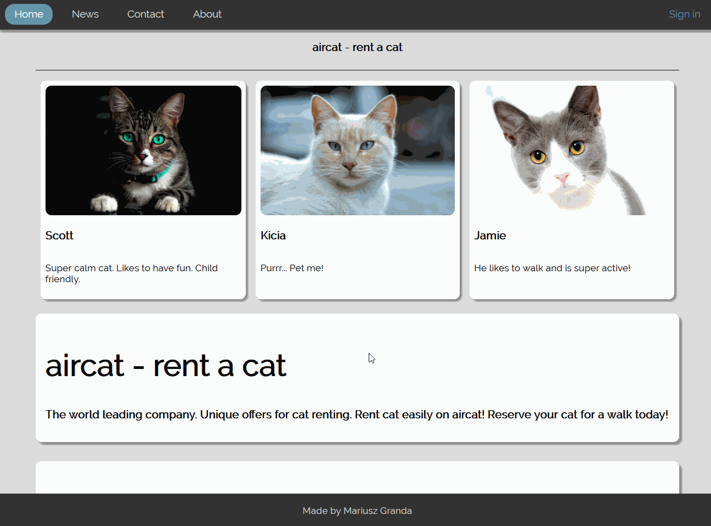

# PWR_WebsiteTesting
A modern responsive site with examples of `Selenium/PHPUnit` testing

`Selenium` was used for automatically testing website, and `PHPUnit` was used for unit tests a function on the server side.

# Preview
Preview of a main site 

Responsivity on mobile devices

# Selenium Testing

Assertion passed (all of the input fields contain correct data)

Assertion failed (`First name` input field contains a number!)

# PHPUnit Testing

Unit testing a function used by the website.

