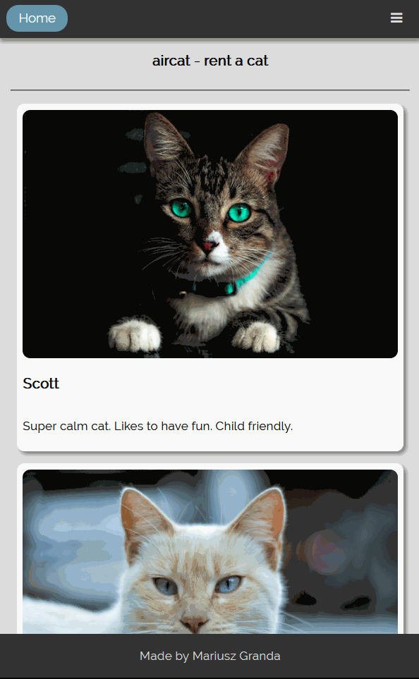
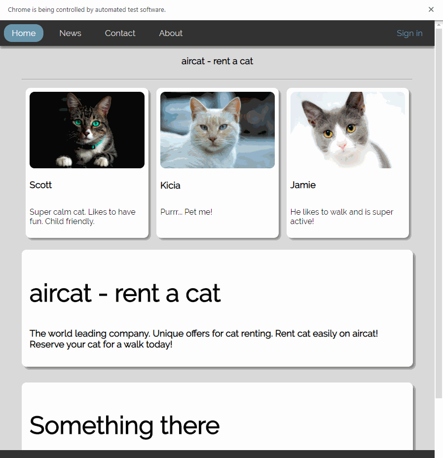

# PWR_WebsiteTesting
A modern responsive site with examples of `Selenium/PHPUnit` testing

`Selenium` was used for automatically testing website, and `PHPUnit` was used for unit tests a function on the server side.
You have to run the website inside XAMPP. Install PyCharm and import `selenium` package for testing. Also install `PHPUnit` within this repository for unit testing using `composer`. 

# Preview
Preview of the main site on a mobile device

# Selenium Testing

Assertion passed (all of the input fields contain correct data)

Assertion failed (`First name` input field contains a number!)

# PHPUnit Testing

Unit testing a function used by the website.

# Useful links

https://www.guru99.com/selenium-python.html

https://www.kainos.pl/blog/first-test-python-webdriver-pycharm/

https://www.youtube.com/watch?v=k9ak_rv9X0Y
